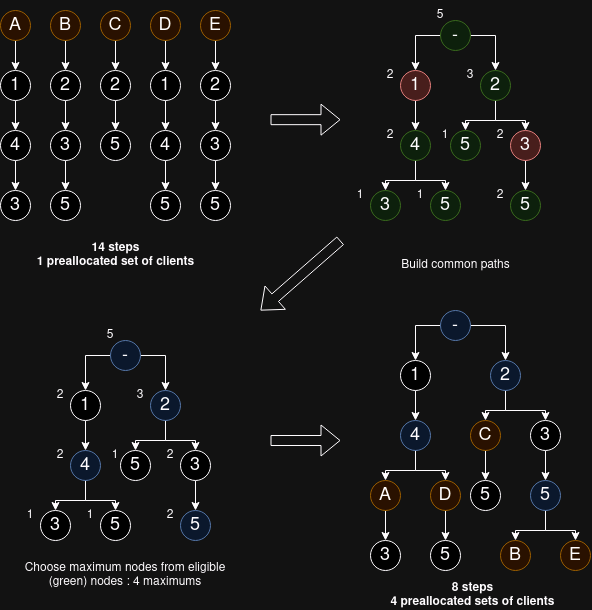

# Distance metric documentation
- Date: July 2024

## Intro
This code in mainly used with the standard centralized learning to track model evolution as well as with the **federated** learning case study. In this later case, distance metrics are responsible for computing the client distances.

## Distance metrics
Distance metrics are identified by their name, it should therefore be unique. **Special characters are prohibited** for distance metric names, because they are used for parsing : <code>-</code>, <code>&</code>.

Distance metrics are divided into 6 groups, each deviring from an another one :
- **<code>ClientMatrixMetric</code>** : Base class of distance metrics, computes client distance matrices from a set of clients.  
*Abstract methods : <code>_client_distance_matrix</code>.*

- **<code>ClientMetric</code>** : Subclass of <code>ClientMatrixMetric</code>, computes distance between a pair of clients. Builds the client distance matrix with this feature.  
**_NOTE:_** Clustering experiments use this type of distance metrics to evaluate client-cluster distances. You can still use its parent class outside or after the experiment.  
*Abstract methods : <code>_client_distance</code>.*

- **<code>ModelMatrixMetric</code>** : Subclass of <code>ClientMatrixMetric</code>, computes model distance matrices. Builds the client distance matrix with this feature, using client models.  
*Abstract methods : <code>_model_distance_matrix</code>.*

- **<code>ModelMetric</code>** : Subclass of <code>ModelMatrixMetric, ClientMetric</code>, computes distance between a pair of models. Also computes client distances and model distance matrices using this feature.  
*Abstract methods : <code>_model_distance</code>.*

- **<code>LayerMatrixMetric</code>** : Subclass of <code>ModelMetric</code>, computes layer distance matrices, from two models (two lists of layers). Also computes model distances with this feature, by aggregating the layer distance matrix.  
*Abstract methods : <code>_layer_distance_matrix</code>, <code>_aggregate_matrix</code>.*

- **<code>LayerMetric</code>** : Subclass of <code>LayerMatrixMetric</code>, computes distance between a pair of layers. Builds the layer distance matrix with this feature. It can be pairwise, meaning it will only compute the diagonal of the layer distance matrix.  
*Abstract methods : <code>_layer_distance</code>.*

**__NOTE:__** All functions starting with an **underscore** are **abstract**, and can be implemented/replaced by the developer.

```python
# Instance-wise
metric = ClientMetric("client_cosine_metric")
metric._client_distance = lambda c1, c2: client_cosine_distance(c1, c2)

# Class-wise
class ClientCosineMetric(ClientMetric):
    def _client_distance(self, client1:dict, client2:dict) -> float:
        return client_cosine_distance(client1, client2)
```

## Preprocessing
The process to compute distances is split in 2 :
- Preprocessing inputs
- Computing

Preprocessing is done by chaining together a list of <code>PreprocessingStep</code>, that individually return a copy (shallow, deep) of the inputs (clients, models). These steps can be added with the variable <code>preprocessing_steps</code>.

```python
# Instance-wise
metric = ClientMetric("client_cosine_metric")
metric.preprocessing_steps += [NoBiasStep(), Flatten2DStep()]
```

Preprocessing is done when calling distance metric methods **without a leading underscore**. These methods also takes a list of ignored steps (<code>None</code> by default), which represent the steps that have already been executed.

```python
preprocessed_clients = preprocess_clients(clients, [WeightBiasFusion2DStep()])
...
metric.client_distance_matrix(preprocessed_clients, ignored_steps=[WeightBiasFusion2DStep()])
```

### Preprocessing tree
When doing multi-metric client distance matrix computations, some chains of preprocessing steps are executed multiple times. A way to fix this small issue is to use a <code>PreprocessingTree</code>.

A <code>PreprocessingTree</code> will join common preprocessing paths together, and select the paths with the most metrics to save computing time, at the cost of preallocating multiple sets of clients, copies (shallow, deep) of the original one.

In this example, 5 metrics contain 14 preprocessing steps total. The algorithm removes 6 redundant steps.



**__NOTE:__** Only use this if preprocessing is very time consuming, and if you have a lot of unused RAM. You may also tune the maximum number of nodes to be selected, to balance the costs.

## Metric set
<code>MetricSet</code> is a class responsible for storing, generating, and distributing distance metrics. 

Distance metrics are stored based on their unique name, and can be retrieved in the same way.

You may generate variants of an existing metric using the <code>MetricSet</code>, by calling the <code>get_metric</code> method with a special name :
- The name needs to consist of arguments and base name, separated by <code>-</code> :  
```python
metric_set.get_metric("arg1-arg2-base_name")
```

- Arguments can contain sub-arguments, separated by <code>&</code> :  
```python
metric_set.get_metric("arg1&subarg1.1&subarg1.2-arg2&subarg2.1-base_name")
```

The <code>MetricSet</code> will recursively (for each argument) create the new metric and store it.

Current list of available arguments :
- <code>nb</code> : Adds the no-bias preprocessing step at the beginning.
- <code>fb</code> : Adds the fusion-bias preprocessing step at the beginning.
- Aggregation key (for <code>LayerMetric</code>) : Overrides the current matrix-aggregation method with the given one. The aggregation key needs to be in <code>LayerMetric.AGGREGATIONS</code>.
    - Sub-argument <code>diag</code> : Sets the new metric as pairwise.


